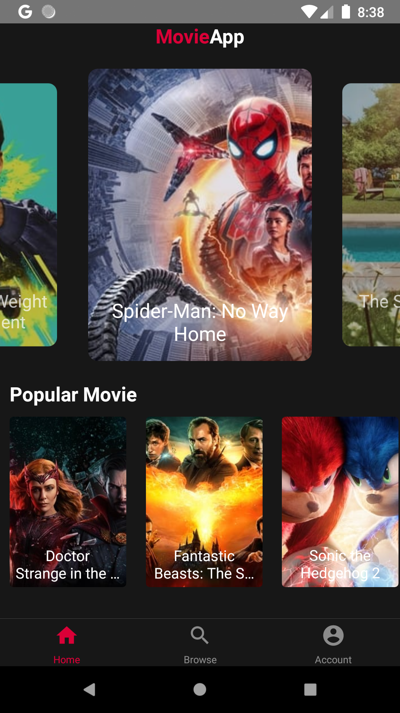
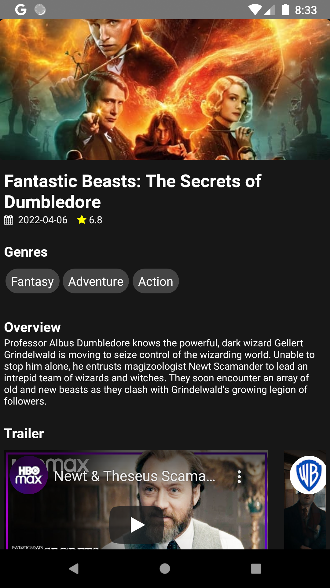
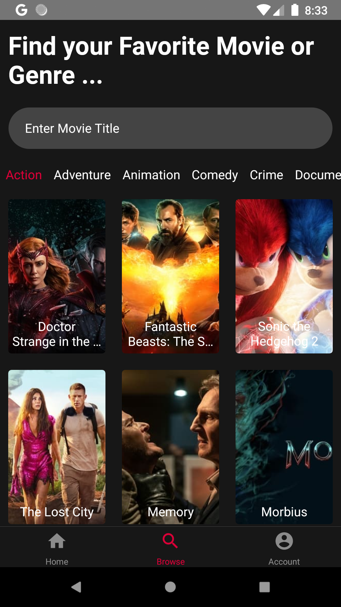
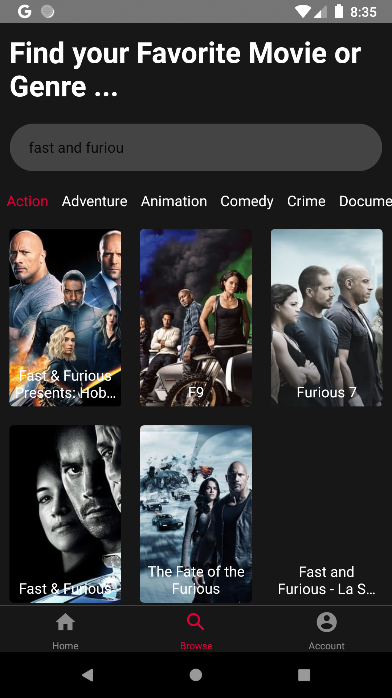

# MovieApp

movieApp adalah aplikasi informasi film yang berisi data dari public api TMDB, app ini saya buat dalam 24 jam sebagai salah satu test masuk sebuah startup.

## Tool

- ReactNative 
- VScode
- NPM
- Nokia 5.1 Plus - android 10 (untuk menjalankan aplikasi saat pengembangan)

## API

saya menggunakan public api dari https://developers.themoviedb.org/3/getting-started/introduction

## APK
Download : https://drive.google.com/file/d/1akA-daQ9oXG6nFujm_nKToamnXLkAoOn/view?usp=sharing

## Screenshoot

